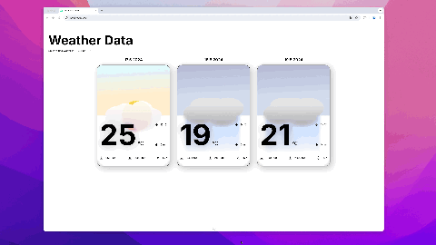

# Weather-App for ws2C Workshop ⛅️

## Brief
Für den Workshop ws2c habe ich mich mit TypeScript beschäftigt.
Nach dem Abschluss eines Online Lernkurses habe ich mich dann dazu entschieden folgendes Web Projekt umzusetzen um das gelernte anwenden zu können.

Mit dem WebApp kann eine Wettervorhersage über drei Tage für auswählbare Orte angezeigt werden.
Der Fokus lag dabei auf der Benützung einer öffentlichen API und der typisierung mittels TypeScript.



## Data Source
Als Datenquelle wurde die [Weather-Forecast API](https://open-meteo.com/en/docs) von Open-Meteo verwendet. Diese API kann ohne Bezahlung verwendet werden.

Mittels Parameter bei einem GET-Request können verschiedene Informationen zur Wetterlage über einen Ort, welcher mittels Koordinaten angegeben werden muss, abgefragt werden.

*Beispiel Request*
```url
https://api.open-meteo.com/v1/forecast?latitude=52.52&longitude=13.41&current=temperature_2m&daily=temperature_2m_max,temperature_2m_min&forecast_days=3
```
> Dieser Request gibt die aktuelle Temperatur sowie die Temperatur-Vorhersagen für die nächsten drei Tage zurück. 

*Beispiel Response*
```json
{
    "latitude": 52.52,
    "longitude": 13.419998,
    "generationtime_ms": 0.026941299438476562,
    "utc_offset_seconds": 0,
    "timezone": "GMT",
    "timezone_abbreviation": "GMT",
    "elevation": 38.0,
    "current_units": {
        "time": "iso8601",
        "interval": "seconds",
        "temperature_2m": "°C"
    },
    "current": {
        "time": "2024-05-22T15:15",
        "interval": 900,
        "temperature_2m": 21.2
    },
    "daily_units": {
        "time": "iso8601",
        "temperature_2m_max": "°C",
        "temperature_2m_min": "°C"
    },
    "daily": {
        "time": [
            "2024-05-22",
            "2024-05-23",
            "2024-05-24"
        ],
        "temperature_2m_max": [
            24.4,
            23.4,
            24.6
        ],
        "temperature_2m_min": [
            15.9,
            15.4,
            14.5
        ]
    }
}
```

## Technologies used
Für die Umsetzung des FrontEnds wurden die folgenden Technologien verwendet:

- Vue.JS
- Nuxt
- TypeScript
- SCSS
- Vite

# TypeScript Focus & Details

## TypeScript used in Project
Die verwendeten Types sind in dem Ordner [types](/types) abgelegt.

Für die Darstellung der Wetter-Kacheln ist vor allem der "WeatherForecastByDay" Type wichtig. So konnten die aufbereiteten Daten der API mittels diesem Typ einfach in der Komponenten [WeatherCard.vue](/components/WeatherCard.vue) dargestellt werden.

```typescript
export interface WeatherForecastByDay {
    time: Date,
    weather_code: number,
    temperature_2m_max: number,
    temperature_2m_min: number,
    sunrise: string,
    sunset: string,
    daylight_duration: number,
    rain_sum: number,
    showers_sum: number
}
```

## Data Fetching
Die Daten von der API werden direkt in der [index](/pages/index.vue) Page gefetched. Auf eine separate Auslagerung wurde für dieses Projekt verzichtet.

## Course
Während der Lernphase des Workshops habe ich den folgenden Kurs durchgearbeitet.
Dieser eignet sich sehr gut für den Einstieg in TypeScript und ist sogar Kostenlos verwendbar.

[Codecademy - TypeScript Kurs](https://www.codecademy.com/learn/learn-typescript)


# Run Project

## Setup

Installiere alle Dependencies mit folgendem Befehl:

```bash
# npm
npm install
```

## Development Server

Starte den lokalen Dev-Server, erreichbar unter folgender URL `http://localhost:3999`:

```bash
# npm
npm run dev
```

© Cédric Wagner 2024